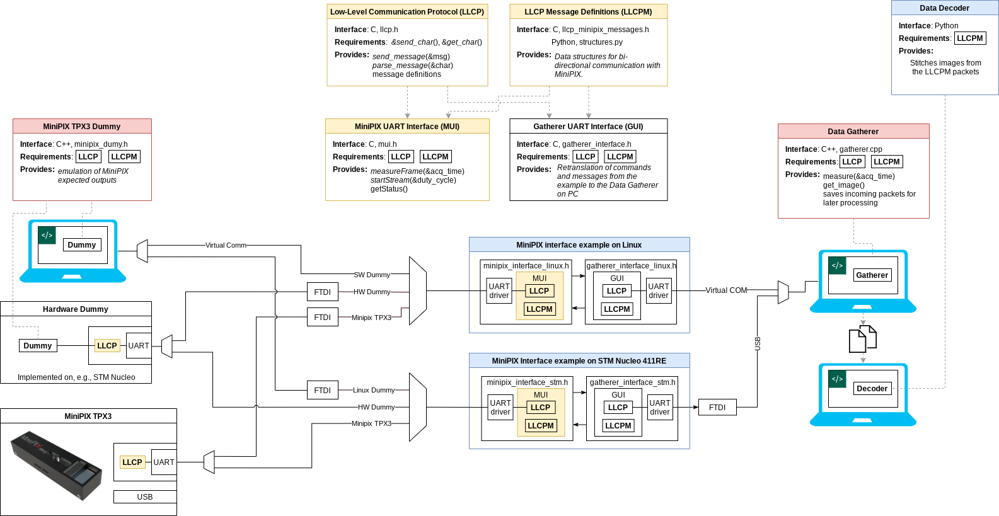
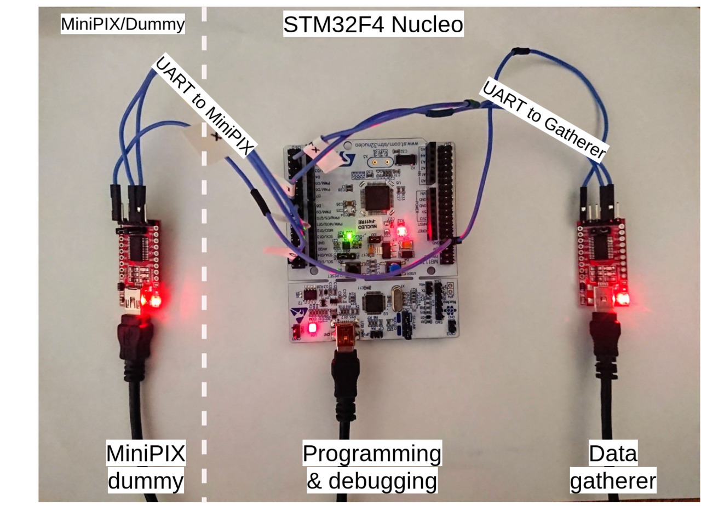

## MiniPIX UART Interface (MUI)

## [Software](https://github.com/klaxalk/tpx_lunar_lander/tree/master/software)

| Build status |  |  |
|--------------|----------------------------------------------------------------------------------------------------------------------------------------------------|--------------------------------------------------------------------------------------------------------------------------------------------------|

Doxygen documentation: [https://klaxalk.github.io/minipix_uart_interface/](https://klaxalk.github.io/minipix_uart_interface/)

## Additional material

### System diagram

### HW diagram

HW diagram of the Dummy<->STM32F4 example<->Gatherer.

### Commands provided by the MiniPIX Interface

| "command"        | description                               | parameters            | output form                                    |
|------------------|-------------------------------------------|-----------------------|------------------------------------------------|
| `getStatus()`    | gets housekeeping data from MiniPIX       | -                     | a string of text, possibly with numeric values |
| `maskPixel()`    | masks a pixel from further acquiring data | pixel coordinates     | -                                              |
| `getFrame()`     | requests image acquisition                | acquisition time      | packetized image                               |

For consideration

| "command"              | description                                  | parameters       | output form       |
|------------------------|----------------------------------------------|------------------|-------------------|
| `getSinglePxlStream()` | requests image stream of single-pixel events | acquisition time | packetized stream |

### Provided code

* meant to be compiled on Linux, e.g., Ubuntu 20.04 (not older)
* MUI and LLPC written in ANSI C
