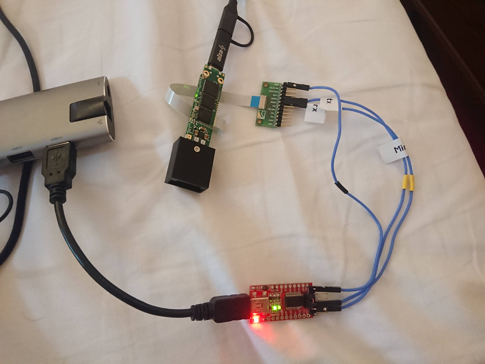

# MiniPIX UART Interface (MUI)

## [Software](https://github.com/klaxalk/tpx_lunar_lander/tree/master/software)

| Build status |  |  |
|--------------|----------------------------------------------------------------------------------------------------------------------------------------------------|--------------------------------------------------------------------------------------------------------------------------------------------------|

Please follow to [software/README.md](./software/README.md) for more information.

### [Generated documentation](https://klaxalk.github.io/minipix_uart_interface/)

MiniPIX TPX3 UART Interface: [mui.h](https://klaxalk.github.io/minipix_uart_interface/mui_2include_2mui_8h.html)

Message definitions: [llcp_minipix_messages.h](https://klaxalk.github.io/minipix_uart_interface/mui_2include_2llcp_2llcp__minipix__messages_8h.html)

## Additional material

### System diagram

### HW diagram

HW diagram of the Linux Dummy + STM32F4 MUI example + Gatherer.

HW diagram of the MiniPIX TPX3 + Linux MUI example + Gatherer.

### Supported operations

The MUI supports only a handful of functions.
The TPX3 measurement is done in a custom _frame mode_.

| "command"                      | description                                | parameters             | returns                    |
|--------------------------------|--------------------------------------------|------------------------|----------------------------|
| `mui_pwr()`                    | turns on/off the TPX3 detector             | 1/0                    | ack                        |
| `mui_getStatus()`              | gets housekeeping data from MiniPIX        | -                      | boot count, status message |
| `mui_getTemperature()`         | gets the MiniPIX's temperature             | -                      | int16_t (°C)               |
| `mui_measureFrame()`           | requests frame acquisition                 | acquisition time [ms]  | packetized frame           |
| `mui_updatePixelMask()`        | set pixel mask                             | pixel coordinates, 1/0 | ack                        |
| `mui_setThreshold()`           | set energy threshold, mostly for debugging | coarse thr, fine thr   | ack                        |
| `mui_setConfigurationPreset()` | switches between pre-loaded configurations | preset ID              | ack                        |
