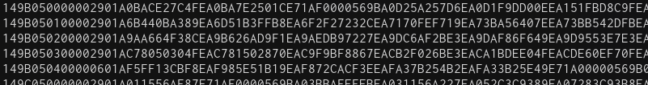
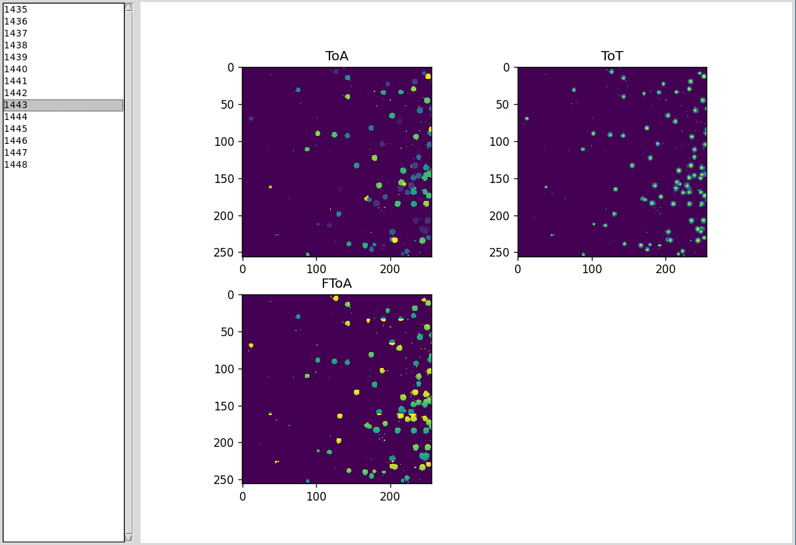
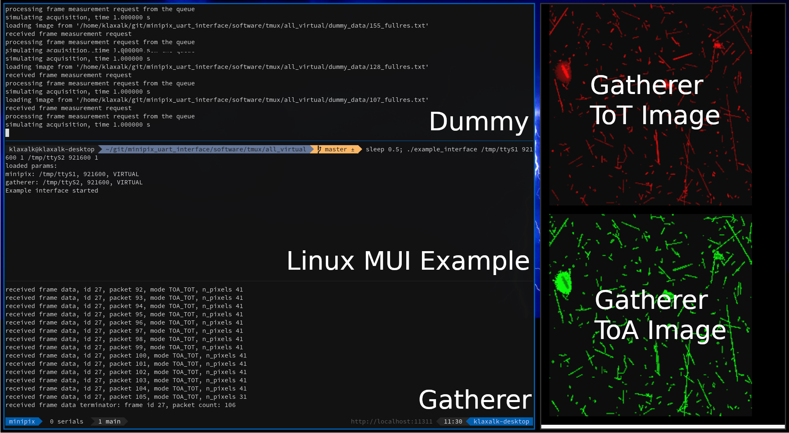

# MiniPIX UART Interface (MUI) - Software

[](../fig/diagram.pdf)

## LLCP - Low-level Communication Protocol

* **C99 library**
* UART link layer between the MiniPIX and the MUI
* capable of sending messages with up to 255 bytes of payload
* can send data in binary or hexadecimal form
* RAM-efficient: uses a single buffer to store received data and to present them to the user after decoding
* **No need to implement this directly, it is already used by the MUI**

## MUI - MiniPIX UART Interface

* **C99 library**
  * needs "virtual" methods to be implemented by the HW integrator
* **uses LLCP** to communicate with the MiniPIX
* provides routines for controling the MiniPIX
* calls user callbacks when new data arrive

## Example interface

* Example usecase of MUI integration is provided for
  * Linux,
  * STM32F411RE Nucleo.

## Dummy - the MiniPIX emulator

* responds identically as the MiniPIX over the UART
* generic C++ implementation with virtual methods for particular platform
* Linux Implementation:
  * Loads real Timepix [data from a database](https://github.com/vzlusat/vzlusat1-timepix-data)
* HW implementation **TODO**
  * **TODO** Possibly STM32F411RE Nucleo or Blue Pill
  * **TODO** Could store a few real images
  * **TODO** Will probably randomly generate images using stored particle tracks

## Gatherer - PC data receiver from the Example interface over FTDI

* optionally, can be compiled with OpenCV GUI: shows incoming images
* saves incoming packeted data into a [file](./gatherer/data/hw_data.txt), to be later processed by the **Decoder**.

Install [OpenCV](https://opencv.org/) for the GUI:
```bash
sudo apt-get -y install libopencv-dev
```
Disable/Enable the GUI in the [CMakeLists.txt](./gatherer/CMakeLists.txt):
```
set(GUI 1)
```

## Decoder - PC data decoder

* stitches packeted data from a file and shows them in a minimalistic GUI.
* consumes HEXadecimalized frame data (_LLCP_FrameDataMsg_t_) that can be obtained from the MUI


 
* minimalistic Python implementation
* contains code for pixel data [deserialization](deserialization) and derandomization

**Screenshot of Decoder GUI:**


## VZLUSAT1-timepix-data

A repository containing Timepix data obtained by the VZLUSAT-1 satellite.
The data is used in the Dummy to emulate measurements.

Download the data by updating the git submodule:
```bash
git submodule update --init --recursive
```

# Running in Tmux sessions

The `tmux` subfolder contains tmuxinator sessions ready for testing.

1. Install `tmux` and `tmuxinator`:

```bash
sudo apt-get -y install tmux tmuxinator
```

2. compile all the Linux software

```bash
./compile.sh
```

3. If testing with the STM32F4 example, compile and flash the microcontroller -> [README.md](./example_interface/stm32f411).

4. If running the Linux MUI example, install virtual serial line:

```bash
sudo apt-get -y install socat
```

5. Run `./start.sh` in the appropriate `tmux/{all_virtual, interface_hw}` sessions.

**Screenshot of the Dummy, Linux MUI Example and the Gatherer running on a Linux PC:**

