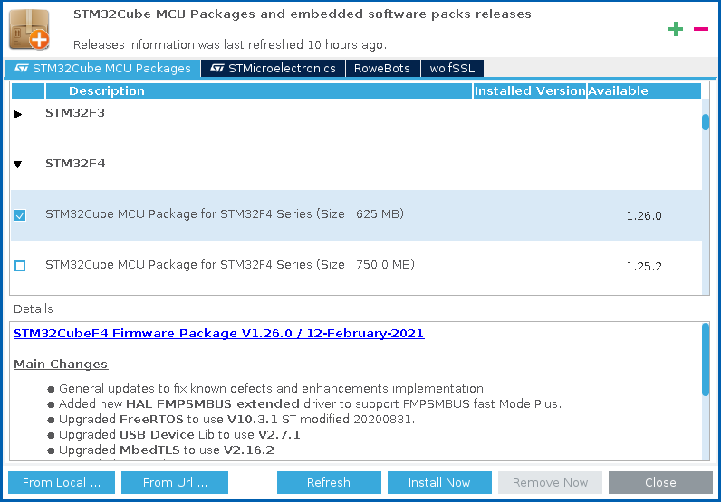

# Compiling the example interface for STM32F411RE Nucleo

## Setting up the resources for STM32F411RE Nucleo

1. download [STM32CubeMX](https://www.st.com/en/development-tools/stm32cubemx.html)
2. install STM32Cube under root into the default directory (`/usr/local`)
```bash
sudo ./SetupSTM32CubeMX-6.2.0
```
3. run STM32Cube
```bash
/usr/local/STMicroelectronics/STM32Cube/STM32CubeMX/STM32CubeMX
```
5. install the latest *software pack* for the STM32F4

they will appear under `~/STM32Cube/Repository/STM32Cube_FW_F4_*`
5. copy the *software pack* under /usr/local
```bash
sudo cp -r ~/STM32Cube/Repository/STM32Cube_FW_F4_* /usr/local
```

## Installing compilation, debugging and flashing toolchain

Install STM tools for flashing and debugging:
```bash
sudo apt-get -y install stlink-tools stm32flash
```

For debugging over STLink using `arm-none-eabi-gdb`, install:
```bash
sudo apt-get -y install gdb-multiarch
```

YouCompleteMe has a problem with stdlib in C. Install this:
```bash
sudo apt-get -y install gcc-multilib
```
