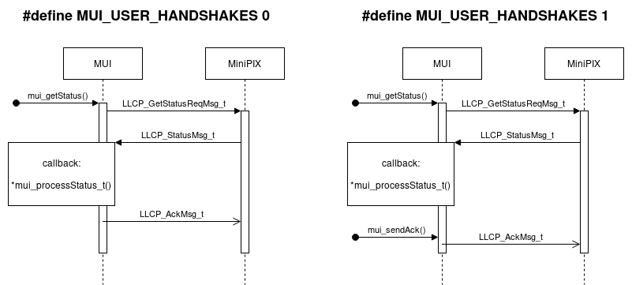
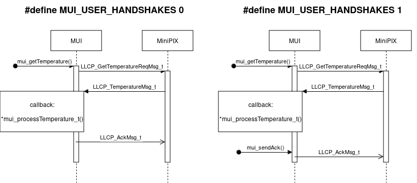
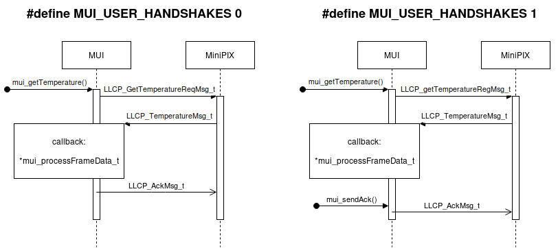
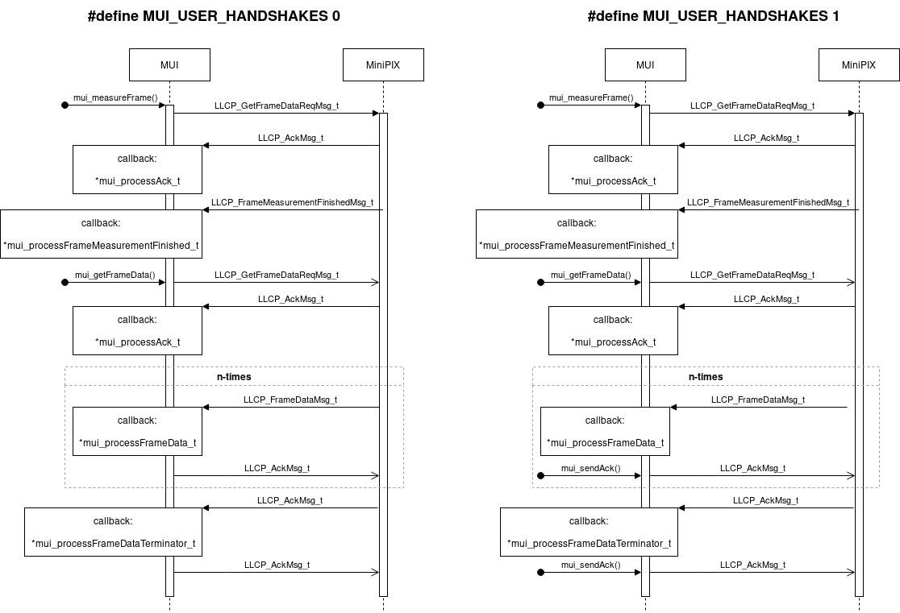
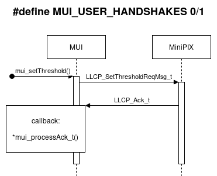
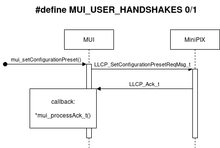
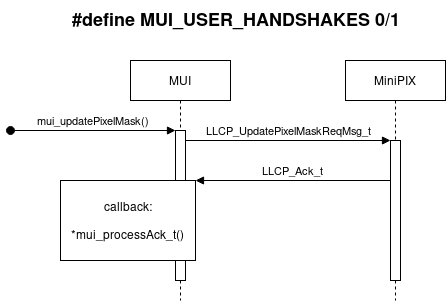

# MiniPIX UART Interface (MUI)

This is a C99 library that facilitates interraction with MiniPIX over UART.
This library is supposed to be incorporated into application code by an integrator of MiniPIX.

More general info and context in the general [README](../README.md).

## Pre-build requirements

The MUI should be compilable without any requirements and modifications from the integrator.
However, several compilation directives can be used to modify the behaviour of the MUI and the underlying LLCP.

### MUI send mode selection

The MUI requires the user to provide an implementation of a method for:
a) **sending a character** over serial line to the MiniPIX, or
b) **sending a string** over serial line to the MiniPIX.
Use the following pre-compiler directives to define which one should be expected by the MUI:
```C
#define MUI_SEND_STRING 1
```

```C
#define MUI_SEND_CHAR 1
```

THe directive should be set in the project's CMakeLists.txt, rather then by changing the `mui.h`, e.g., as:
```
target_compile_definitions(<targer> PRIVATE MUI_SEND_CHAR=1)
```

### LLCP customization

LLCP can operate in either binary or hexadecimal transmission mode.
MiniPIX will most probably be set for the binary (default).
However, if you use LLCP for a custom project, or if you have MiniPIX set explicitly for HEX, change the behavior during compilation by the following define before including `mui.h`.
```C
#define LLCP_COMM_HEXADECIMAL 1
```

Debug print can be enabled in LLCP by defining:

```C
#define LLCP_DEBUG_PRINT 1
```

For more niche options, see .

### MUI customization

MUI allows the user/integrator to handle the communication _acking_ manually by defining:
```C
#define MUI_USER_HANDSHAKES 1
```
Otherwise, acks are sent automatically by the MUI after the user callback is executed.
Manual acking could be useful if the user/integrator requires more control of timings of the incomming data, particularly after calling `mui_getFrameData()`.
For details, please see the communication flow diagrams below under the label `#define MUI_USER_HANDSHAKES 1`.

## Run-time initialization

Adapting MUI requires to pass pointers to user implementated and hardware-specific functions.

1. Include the `mui.h`j
```C
#include <mui.h>
```
2. Initialize the MUI handler:
```C
MUI_Handler_t mui_handler;
```
3. Pass pointer to one of the data sending functions
```C
// the user can supply either sendChar or sendString method
// MUI needs this compiler preprocessor definition to build itself using the right one
// please supply the definition during compilation, e.g., in CMakeLists
#if MUI_SEND_CHAR == 1
  mui_handler.fcns.sendChar = &my_impl_sendChar;
#elif MUI_SEND_STRING == 1
  mui_handler.fcns.sendString = &my_impl__sendString;
#endif
```
4. Pass pointers to callback functions (will be called when data arrive):
```C
mui_handler.fcns.processFrameData                = &my_impl_processFrameData;
mui_handler.fcns.processFrameDataTerminator      = &my_impl_processFrameDataTerminator;
mui_handler.fcns.processStatus                   = &my_impl_processStatus;
mui_handler.fcns.processTemperature              = &my_impl_processTemperature;
mui_handler.fcns.processChipVoltage              = &my_impl_processChipVoltage;
mui_handler.fcns.processAck                      = &my_impl_processAck;
mui_handler.fcns.processMinipixError             = &my_impl_processMinipixError;
mui_handler.fcns.processFrameMeasurementFinished = &my_impl_processMeasurementFinished;
```
4. Pass pointers to misc functions:
```C
mui_handler.fcns.ledSetHW = &mui_linux_ledSetHW; // Can blink with an LED. Do nothing otherwise.
mui_handler.fcns.sleepHW  = &mui_linux_sleepHW;  // Should sleep for #n milliseconds. Currently not used, but might be in future.
```
5. Call the _initialize_ method:
```C
mui_initialize(&mui_handler);
```

## Operating MiniPIX with the MUI

### Provide the handler with incoming data

For each character (byte) comming over UART from the MiniPIX, call the following callback to the MUI:
```C
mui_receiveCharCallback(&mui_handler, <char>);
```

### Masking dead or noisy pixels

Timepix3 pixels can melfunction in the following ways:
1. A pixel is dead and it is not outputting any signal.
2. A pixel is _yelling_ invalid data (need to be masked).
3. A pixel is _kidnapping_ transfer token making other pixels appear dead.
Pixel can be masked directly in the Timepix3 chip, which solves the mentioned problems.
The MUI nor the MiniPIX do not save the masked pixel list, therefore, masking needs to be issued **manually after each powerup** in the following sequence:

1. Power the Timepix3 on:
```C
mui_pwr(&mui_handler, true);
```
2. Mask the pixels
```C
for pixel_to_mask in pixels do:
  mui_updatePixelMask(&mui_handler, mask_msg);
```
3. Set the measurement preset:
```C
mui_setConfigurationPreset(&mui_handler, preset_msg);
```

Explanation: The pixel mask is saved into measurement presets. The masking is actually applied by explicitly loading the preset into the Timepix3 chip.

## Communication flow diagrams

### mui_pwr()


### mui_getStatus()



### mui_getTemperature()



### mui_getChipVoltage()


### mui_measureFrame()



### mui_setThreshold()



### mui_setConfigurationPreset()



### mui_updatePixelMask()


